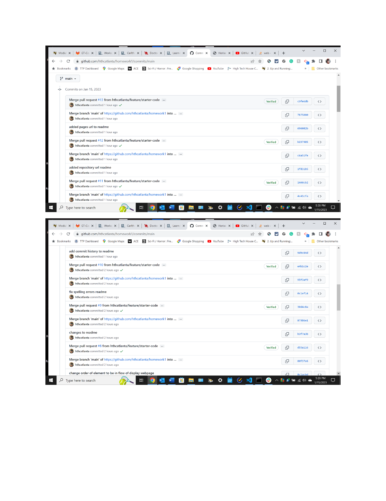

# homework1 -refractor of Horiseon Website mockup

## Refractor of Horiseon Website mockup for marketing

Structure of HTML file uses semantic HTML elements.
Modify title of webpage to help promote SEO.
In CSS file, like elements are grouped together and are displayed in the order rendered on the webpage.

## Installation

Publish website to GitPages
URL of GitPage publish
 https://hthcatlanta.github.io/homework1/
 
 URL of GitHub Repository
https://github.com/hthcatlanta/homework1.git
## Usage
Marketing website to attract and educate current and future clients.
    
## Commit log
 History of Commits (note later commits to fix readme are not included)

## INDEX.html

## Style.css

## Lessons Learned
Be careful of directory structure of local repo. Just because your can render on live server does not mean you can publish. Fixing this error after having a working solving required me to redo the work because I deleted the wrong directory with the right code.

Create a small test bed to work on syntax problems. 

Ask for help early and often.

Sometimes too much knowledge is worse not not enough. Googling problems can and will allow you to enter a rabbit hole if you let it. Step away from the Internet and reassess what the problem is you are trying to solve.